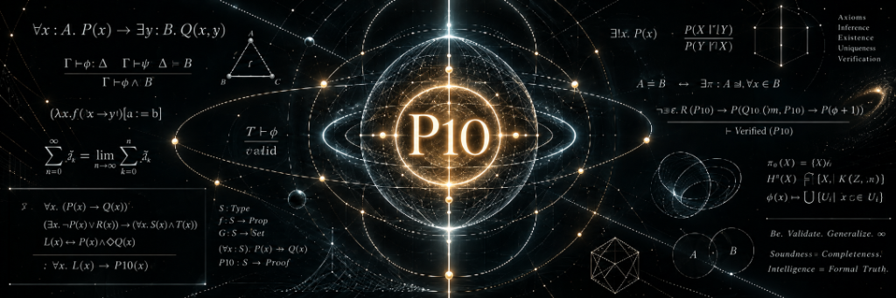

# P10-Core — A Certificate-Carrying Verification Protocol with Explicit Trust Boundaries

<p align="center">
  
</p>

**Milestone:** `P10-Core / FourEvidence — First Machine-Checked Seed`  
**Release Tag:** `v0.1.0-four-evidence`  
**Author:** VolMax Studio Lab / Nestorov, Ivan (ORCID: [`0009-0006-7940-9539`](https://orcid.org/0009-0006-7940-9539))  
**Contributors:** Ivan Nestorov, Sol, Astra, Ananke  
**Toolchain:** Lean 4.34.0 (`leanprover/lean4:v4.34.0`), Lake 5.0.0  
**License:** Apache 2.0  

---

## 1. Overview

**P10-Core** is a formal, certificate-carrying verification protocol designed to adjudicate empirical and operational claims under pre-registered, immutable evidentiary rules.

Rather than acting as an ungrounded or autonomous "truth machine," P10-Core formalizes the strict mathematical demarcation between ontological truth and evidentiary support:

$$\operatorname{Truth}_M(c) \;\neq\; \operatorname{Supports}_P(e, c, \kappa, v)$$

A positive verification indicates that an admissible evidence bundle $e$, evaluated under frozen protocol rules $P$, deterministically yields certificate $\kappa$ supporting verdict $v$. When evidence is insufficient, the protocol does not declare falsehood; it strictly and soundly outputs `NotDemonstrated`.

This repository contains the **first machine-checked seed** of P10-Core in Lean 4: a fully verified, synthetic `FourEvidence` instance establishing executable checker soundness against a declarative calculus.

---

## 2. Formal Architecture

P10-Core formalizes the assurance process as an explicit tuple:

$$\mathbf{P10} = (C, E, R, F, \mathcal{V}, D, H)$$

where:
- **$C$ (Claim):** The proposition under audit;
- **$E$ (Evidence Bundle):** The external, hashed input dataset;
- **$R$ (Rules):** The formal admissibility and semantic transformation rules;
- **$F$ (Frozen Protocol):** The pre-registered cryptographic commitment;
- **$\mathcal{V}$ (Verdicts):** The discrete, mutually disjoint verdict type:
  $$\mathcal{V} = \{\texttt{verified}, \texttt{notDemonstrated}, \texttt{unfalsifiableAsStated}, \texttt{deferred}\}$$
- **$D$ (Decision Procedure):** The computable function mapping inputs to a run outcome:
  $$\operatorname{RunOutcome} = \operatorname{Verdict}(v, \kappa) \;\uplus\; \operatorname{ProtocolError}(\epsilon, \rho)$$
- **$H$ (Human Ratification):** The terminal socio-technical act separating mechanical execution from binding legal/institutional issuance:
  $$\operatorname{IssuanceOutcome} = \operatorname{Issued} \;\uplus\; \operatorname{RejectedByRatifier} \;\uplus\; \operatorname{RatificationError}$$

---

## 3. The Mechanized Theorems (`FourEvidence`)

The formalization targets a concrete, synthetic instance:
$$c: \text{„exactly } n=4 \text{ evidence entries satisfy predicate } P\text{.“}$$

All theorems in [`P10Core/Proofs/FourEvidence.lean`](P10Core/Proofs/FourEvidence.lean) are fully machine-checked by the Lean 4.34.0 kernel:

### 1. Checker Soundness (Core Theorem)
An independent checker verifying the certificate guarantees the existence of declarative evidence support:

```lean
theorem checkCert_sound
    (D : DigestModel) (P : Protocol) (c : Claim) (e : Evidence)
    (κ : Certificate) (v : Verdict)
    (hcheck : CheckCert D P c e κ v = true) :
    Supports (semantics P) e c κ v
```

### 2. Semantic Alignment Invariants
Declarative support guarantees the exact state of empirical conditions:

```lean
-- Verified support implies semantic conditions hold
theorem supports_verified_implies_conditions
    (P : Protocol) (e : Evidence) (c : Claim) (κ : Certificate)
    (h : Supports (semantics P) e c κ .verified) : verifiedSem (c, e)

-- NotDemonstrated support implies semantic conditions fail
theorem supports_notDemonstrated_implies_not_conditions
    (P : Protocol) (e : Evidence) (c : Claim) (κ : Certificate)
    (h : Supports (semantics P) e c κ .notDemonstrated) : ¬verifiedSem (c, e)

-- Deferred support guarantees existence of an external blocker
theorem supports_deferred_implies_external_blocker
    (P : Protocol) (e : Evidence) (c : Claim) (κ : Certificate)
    (h : Supports (semantics P) e c κ .deferred) :
    ∃ b, (semantics P).externalBlocker c e b
```

### 3. Disjointness of Non-Trivial Verdicts
The protocol mathematically forbids simultaneous verification and non-demonstration:

```lean
theorem verified_not_notDemonstrated
    (P : Protocol) (e : Evidence) (c : Claim) (κ₁ κ₂ : Certificate)
    (hv : Supports (semantics P) e c κ₁ .verified)
    (hn : Supports (semantics P) e c κ₂ .notDemonstrated) : False
```

---

## 4. Trust Boundaries & Axiom Audit

This formalization adheres to the P10 principle: **never hide trust—explicitly bound and name it.**

As audited in [`AXIOM_AUDIT.md`](AXIOM_AUDIT.md):
- **Zero `sorry` / zero `admit`:** The proof tree contains no unproved goals.
- **Zero user-declared `axiom`:** No custom axioms are introduced into the Lean environment.
- **Kernel Axiom Report:**
  ```text
  'P10Core.Proofs.FourEvidence.checkCert_sound' depends on axioms: [propext, Quot.sound]
  'P10Core.Proofs.FourEvidence.verified_not_notDemonstrated' does not depend on any axioms
  ```
  `propext` (propositional extensionality) and `Quot.sound` (quotient soundess) are standard foundational axioms of Lean 4.
- **Domain-Specific Premise:** Evidence digest injectivity is formulated as an explicit model hypothesis (`DigestModel.injective`), not as an unchecked global axiom. It can be instantiated later by any concrete, collision-resistant hash function.

---

## 5. Explicit Epistemic Boundaries (What is NOT Claimed)

To prevent marketing overclaims and maintain rigorous scientific hygiene:
1. **No Global Soundness Claim:** This milestone does *not* prove that P10 is globally sound across all possible empirical domains. It proves checker soundness for the bounded `FourEvidence` instance.
2. **No Claim of Ontological Truth:** Verifying a certificate proves that the evidence chain satisfies the frozen rules; it does not prove physical truth outside the specified bridge assumptions ($B_i$).
3. **No Cryptographic Collision Proof:** The evidence digest is abstract; physical hash collisions are outside the first-order logic model.
4. **No Composition Theorem (Yet):** The conditional composition theorem ($\bigwedge_i \text{LocalSound}_i \land \text{Fidelity}_i \implies \text{GlobalSupport}$) is the explicit target of Milestone 2.

---

## 6. Repository Structure

```text
p10-core/
├── assets/
│   └── p10_core_banner.png        # Official project banner
├── AXIOM_AUDIT.md                 # Complete axiom and trust boundary audit
├── CITATION.cff                   # Academic citation metadata
├── LICENSE                        # Apache 2.0 License
├── P10Core.lean                   # Top-level module import
├── README.md                      # Primary project overview
├── lakefile.toml                  # Lake package definition
├── lake-manifest.json             # Pinned package dependencies
├── lean-toolchain                 # Pinned Lean toolchain (v4.34.0)
├── P10Core/
│   ├── Spec/
│   │   └── Core.lean              # Core P10 data types and verdict definitions
│   ├── Model/
│   │   ├── Calculus.lean          # Declarative Supports calculus
│   │   └── Rules.lean             # Rule definitions and soundness interfaces
│   ├── Instances/
│   │   └── FourEvidence/
│   │       ├── Model.lean         # Concrete FourEvidence instance model
│   │       └── Checker.lean       # Executable certificate checker
│   └── Proofs/
│       └── FourEvidence.lean      # Kernel-checked soundness & disjointness proofs
├── scripts/
│   ├── AxiomAudit.lean            # Standalone axiom verification script
│   └── reproduce.sh               # Clean-room build and audit runner
└── spec/
    ├── P10-Core-v0.1.md           # Architectural specification v0.1
    ├── P10-Core-v0.2.md           # Specification v0.2 (Disjoint verdicts & contracts)
    └── P10-Core-v0.2.1.md         # Specification v0.2.1 (Decoupled PreflightResult)
```

---

## 7. Clean-Room Reproduction

To verify and recompile from source using Lean 4.34.0:

```bash
# Automated clean-room verification:
./scripts/reproduce.sh

# Or manual build:
lake build
lake env lean scripts/AxiomAudit.lean
```
